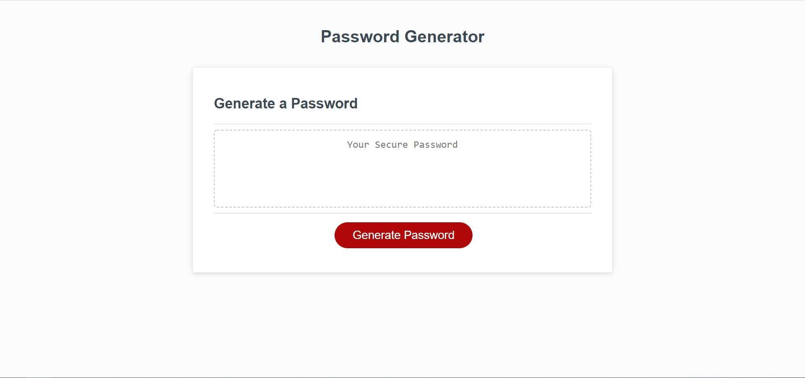

# week-3-challenge: Password Generator

1. Added prompts to ask for character length, to include uppercase, lowercase, number and/or special characters
2. Added for loop to randomly generate password based on user input
3. script.js includes comments

Screenshot of website

[URL of GitHub Repository](https://github.com/ehliao/week-3-password-generator)

[URL of deployed application](https://ehliao.github.io/week-3-password-generator/)